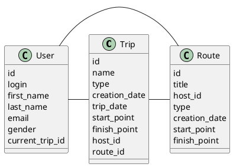

# Компонентная архитектура
<!-- Состав и взаимосвязи компонентов системы между собой и внешними системами с указанием протоколов, ключевые технологии, используемые для реализации компонентов.
Диаграмма контейнеров C4 и текстовое описание. 
-->
## Компонентная диаграмма

```plantuml
@startuml
!include https://raw.githubusercontent.com/plantuml-stdlib/C4-PlantUML/master/C4_Container.puml

AddElementTag("microService", $shape=EightSidedShape(), $bgColor="CornflowerBlue", $fontColor="white", $legendText="microservice")
AddElementTag("storage", $shape=RoundedBoxShape(), $bgColor="lightSkyBlue", $fontColor="white")

Person(user, "Пользователь")

System_Ext(web_site, "Клиентский веб-сервис", "HTML, CSS, JavaScript, React", "Веб-интерфейс")

System_Boundary(conference_site, "Сайт блогов") {
   'Container(web_site, "Клиентский веб-сайт", ")
   Container(client_service, "Сервис авторизации", "C++", "Сервис управления пользователями", $tags = "microService")    
   Container(post_service, "Сервис маршрутов", "C++", "Сервис управления маршрутами", $tags = "microService") 
   Container(blog_service, "Сервис поездок", "C++", "Сервис управления поездками", $tags = "microService")   
   ContainerDb(db, "База данных", "MySQL", "Хранение данных о пользователях, маршрутах и поездках", $tags = "storage")
   
}

Rel(user, web_site, "Регистрация, поиск пользователей по логину или имени и фамилии, создание и удаление собственных маршрутов/поездок, просмотр поездок/маршрутов других пользователей")

Rel(web_site, client_service, "Работа с пользователями", "localhost/person")
Rel(client_service, db, "INSERT/SELECT/UPDATE", "SQL")

Rel(web_site, post_service, "Работа с маршрутами", "localhost/pres")
Rel(post_service, db, "INSERT/SELECT/UPDATE", "SQL")

Rel(web_site, blog_service, "Работа с поездками", "localhost/conf")
Rel(blog_service, db, "INSERT/SELECT/UPDATE", "SQL")

@enduml
```
## Список компонентов  

### Сервис авторизации
**API**:
-	Создание нового пользователя
      - входные параметры: login, пароль, имя, фамилия, email, пол(м/ж)
      - выходные параметры: отсутствуют
-	Поиск пользователя по логину
     - входные параметры:  login
     - выходные параметры: имя, фамилия, email, пол(м/ж)
-	Поиск пользователя по маске имени и фамилии
     - входные параметры: маска фамилии, маска имени
     - выходные параметры: login, имя, фамилия, email, пол(м/ж)

### Сервис маршрутов
**API**:
- Создание маршрута
  - Входные параметры: название маршрута, категория, координаты начала, координаты конца, создатель, дата создания, предпологаемая дата поездки
  - Выходыне параметры: идентификатор маршрута
- Получение маршрутов пользователя
  - Входные параметры: имя и фамилия/login
  - Выходные параметры: список маршрутов, где для каждого указаны его идентификатор, название, категория, координаты начала, координаты конца, создатель, дата создания

### Сервис поездок
**API**:
- Создание поездки
  - Входные параметры: название поездки, создатель, категория, координаты начала, координаты конца, дата создания, дата поездки, количество попутчиков
  - Выходные параметры: идентификатор поездки
- Подключение пользователей к поездке
  - Входные параметры: идентификатор поездки, login пользователя
  - Выходные параметры: идентификатор текущей поездки пользователя
- Получение информации о поездке
  - Входнае параметры: идентификатор поездки
  - Выходные парамтеры: название поездки, создатель, категория, координаты начала, координаты конца, дата создания, дата поездки, количество попутчиков


### Модель данных
